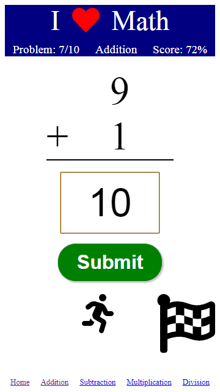

# I Love Math (Angular Version)

### Table of Contents
1. Project Demo Link 
2. Purpose
3. Motivation
4. Objectives
5. Technologies Used

### Project Demo Link: [I Love Math](https://jcsmileyjr.github.io/ilovemathAngular/home)

### Purpose:
A math practice app for a boy.

### Motivation:
I was inspired by my daughter who wanted to help her little brother learn math with a app. She described how she wanted it to look and the functionality. 

### Objectives:
* The user is given the choice of practicing addition, subtraction, division, and multiplication.
* The user will be given 10 problems with the numbers being 1-10. 
* The user is constantly reminded of the number of questions remaining and the score.
* A non-distracting boy theme animation to make it fun

### This app was built with the following technologies:
**Angular:** JavaScript web development framework 
 
**Git-Hub:** Web-based version control repository and Internet hosting service
 
**Flexbox:** A CSS based layout technology for building responsive websites
  
**JavaScript:** Object-oriented programming language for web pages
 
**HTML:** Mark-up language for creating web pages 
 
**CSS:** A formatting language for styling web pages
 
*Create by JC Smiley in January of 2019*
